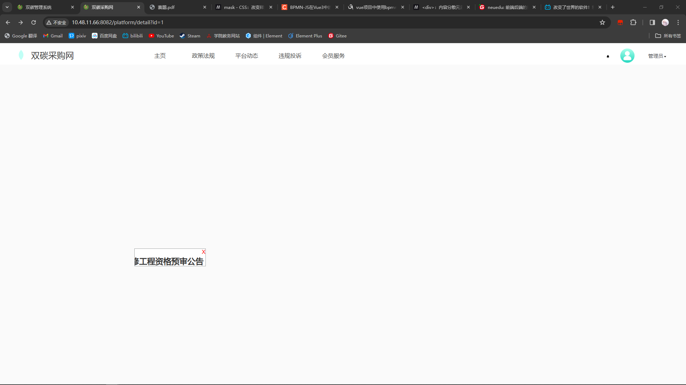
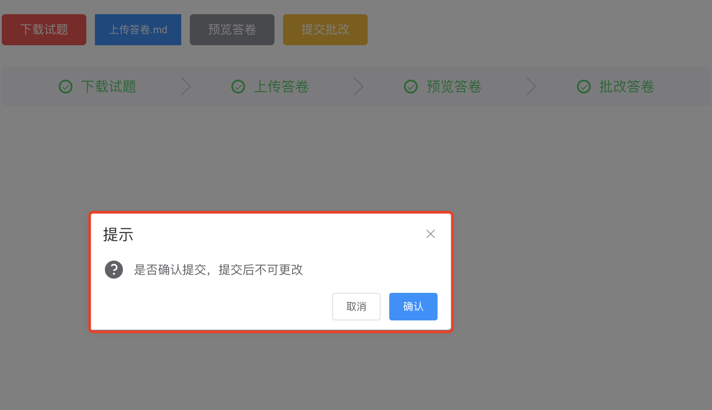

# 目录

- [前端](#chapter-0)
  - [001 图片加水印](#chapter-001)
  
  - [002 页面右上角显示 审核通过 字样](#chapter-002)
  
  - [003 下载](#chapter-003)
  
  - [004 上传文件](#chapter-004)
  
  - [005 键盘事件](#chapter-005)
  
  - [006 滑块拼图验证](#chapter-006)
  
  - [007 鼠标签名](#chapter-007)
  
  - [008 树结构](#chapter-008)
  
  - [009 弹出式菜单](#chapter-009)
  
  - [010 下拉树](#chapter-010)
  
  - [011 限制输入手机号码](#chapter-011)
  
  - [012 头像裁剪与上传](#chapter-012)
  
  - [013 浮窗](#chapter-013)
  
  - [014 文字跑马灯](#chapter-014)
  
  - [015 拖拽色块改变容器背景色](#chapter-015)
  
  - [016 工作流](#chapter-016)
  
  - [017 PDF文件预览](#chapter-017)
  
  - [018 页面数据用浮动卡片展示](#chapter-018)
  
  - [019 Web3D](#chapter-019)
  
  - [020 中国地图](#chapter-020)
  
  - [021 弹性布局-横向平分父窗口](#chapter-021)
  
  - [022 计时器](#chapter-022)

  - [023 popover卡片](#023-popover气泡卡片自定义偏移量)

  - [024 登录后只触发一次](#024-只在用户登录后触发一次事件)

  - [025 解决跳转后页面空白，刷新后正常](#025-页面跳转后自动刷新)

  - [026 可拖动浮窗](#026-可拖动浮窗)
  
  - [027 点击按钮弹出确认框](#027-点击按钮弹出确认框)
  
  - [028 步骤条](#028-步骤条)

  - [029 页面跳转在新窗口打开](#029-页面跳转在新窗口打开)
  
  - [030 页面内容禁用复制功能](#030-页面内容禁用复制功能)

  - [031 附件下载](#031-附件下载)

  - [032 消息提示框](#032-头像左侧的消息提示)

  - [033 背景图片切换](#033-背景图片切换)

  - [034 页面刷新的4种写法](#034-页面刷新)

  - [035 回到顶部](#035-滚动回到顶部)

  - [036 音频播放器](#036-页面播放音乐)
  
- [后端](#chapter-1)
  - [101 上传文件](#chapter-101)

  - [102 上传Base64图片](#chapter-102)

  - [103 二维码异常](#chapter-103)

- [CSS样式层叠](#css样式层叠)
  - [常用css样式](#常用css样式集合)


# 前端 {#chapter-0}

## 001 图片加水印 {#chapter-001} 
- 需求 >> 点击按钮，在弹窗中打开图片，并图片中生成固定的文字水印，点击弹窗外任意位置，弹窗关闭
- 解决思路 >> 使用canvas绘制图像并添加水印，导出base64图像加载给`img`标签
- 前端代码

```vue
<template>
  <div class="app-container">
    <el-dialog class="el-dialog__body"
      :title="imageDialog.title"
      :visible.sync="imageDialog.open"
      append-to-body
      :show-close="false"
      width="500px"
      height="500px">

      

    </el-dialog>
  </div>
</template>
<script>
  import { getBaseUrl } from '@/utils/env';
  export default {
    data() {
      return {
        imageDialog: {
          title: "",
          open: false,
          url: ""
      	}
      };
    },
    methods: {
      handleShowImage(row) {
        //准备数据
        this.imageDialog.open = true;
        this.imageDialog.title = "";
        this.imageDialog.url = location.protocol+"//"+location.host+getBaseUrl()+row.imagePath;

        //创建画布
        let canvas = document.createElement('canvas')

        //创建图像
        let img = new Image();

        //载入网络原图
        img.src = this.imageDialog.url;

        //图片渲染
        img.onload = function(){
          //创建画笔
          let ctx = canvas.getContext("2d");
          //擦除全部
          //ctx.clearRect(0,0, canvas.width, canvas.height);
          if(img.height > 500){
            img.width *= 500 / img.height;
            img.height = 500;
          }
          if(img.width > 500){
            img.height *= 500 / img.width;
            img.width = 500;
          }

          //设定画布的宽高
          canvas.width = img.width;
          canvas.height = img.height;

          //向画布画图，画满整个画布
          ctx.drawImage(img, 0, 0, canvas.width, canvas.height);

          //给画布添加文字水印
          ctx.font = '30px 微软雅黑';
          ctx.fillStyle = '#ddd';
          ctx.textAlign = 'center';
          ctx.textBaseline = 'middle';
          ctx.fillText("这是水印", canvas.width/2, canvas.height/2);

          //保存
          ctx.save();

          //画布导出为base64图片
          let imgUrl = canvas.toDataURL("image/jpeg");

          //新图添加到img标签
          document.getElementById("imgshow").setAttribute('src',imgUrl);
        }
    	},
    },
  }
</script>
<style lang="scss" scoped>
  ::v-deep .el-dialog__body {
    margin: 0;
    padding: 0;
  }
</style>
```

- 解决思路 >> 用div方式实现水印，设置样式位置为绝对定位，设置字体大小，透明度与旋转角度

```html
<div class="sy">双碳采购网</div>
```

```css

.sy {
  position: absolute;
  top: 300px;
  left: 30%;
  font-size: 70px;
  opacity: 50%;
  transform: rotate(45deg);
}
```


## 002 页面右上角显示 审核通过 字样 {#chapter-002}

- 需求 >> 打开页面，页面右上角显示 "审核通过"字样，字样向右旋转30度，字体颜色为绿色
- 解决思路 >> 用样式控制div中的文本的显示位置，使用 `transform: rotate(30deg)`达到倾斜30度的效果
- 前端代码如下

```html
<template>
  <div class="app-container">
    <div class="rotated-text">审核通过</div>
  </div>
</template>
```

```css
<style lang="scss" scoped>
.rotated-text {
  position: absolute;
  top: 0;
  right: 0;
  padding: 10px;
  transform: rotate(30deg);
  color: green;
}

</style>
```

- 有待解决的问题 >> "审核通过"文本外有绿色边框 >> 已解决 >> `border`属性设置边框

```css
<style lang="scss" scoped>
.rotated-text {
  position: absolute;
  top: 0;
  right: 0;
  padding: 10px;
  transform: rotate(30deg);
  color: green;
  border-style: solid;
  border-width: 2px;
  border-color: green;
}
</style>
```


## 003 下载 {#chapter-003}

- 需求 >> 点击按钮后实现目标文件下载
- 解决思路 >> 在前端基础框架中添加下载函数，将下载接口加入允许访问名单
- 前端代码 >> `neu.js`git

```js
// 按目标文件指定路径下载文件
export function downloadResource(fileName) {
  window.location.href = baseURL + "/common/download/resource?fileName=" + encodeURI(fileName);
}
```

- 前端代码 >> 点击按钮下载

```html
<template>
  <div>
    <table>
      <tr v-for="(item, index) in policyDetail.files">
        <td>{{item.fileName}}</td>
        <td><el-button type="text" @click="down(item.filePath)">下载</el-button></td>
      </tr>
    </table>
  </div>
</template>
```

```javascript
import { downloadResource } from '@/utils/neu'
export default {
  methods: {
		down(path){
  		downloadResource(path);
		}
  }
}
```

- 后端代码 >> 下载接口注册到白名单 >> `com/neu/framework/config/SecurityConfig.java`

```java
public class SecurityConfig extends WebSecurityConfigurerAdapter {

    //省略其他代码
    private static final String[] PERMIT_LIST = {
      //将下载接口添加到可以访问的名单中
      "/common/download/resource"
    };
}
```

## 004 上传文件 {#chapter-004}

- 需求 >> 点击按钮后上传文件
- 解决思路 >> 前端提供了文件上传的组价， 注意传值和回调方法，注意文件上传接口保存入白名单
- 前端代码 >> 页面

```html
<template>
  <div class="app-container">
    <FileUpload @status-event="handleStatus"/>
    <!-- status-event 是组件自定义事件，用于组件回调方法 -->
  </div>
</template>
<script>
  import FileUpload from '@/components/FileUpload/index.vue';
  export default {
    components: {
    	FileUpload,
  	},
    methods: {
      /** 上传回调 */
      handleStatus(status, list){
        //status是上传发出的状态码
        //list是上传完毕的文件列表
        
        //上传执行完毕
        if (status === false){
          if (list.length === 0){
            //上传失败，处理后续操作
          }else {
            //上传成功，处理后续操作
          }
        }
      },
    },
  }
</script>
```

- 前端代码 >>文件上传组件 >> `components/FileUpload/index.vue`

```vue
<template>
  <div class="upload-file">
    <el-upload :action="uploadFileUrl" :before-upload="handleBeforeUpload" :file-list="fileList" :limit="limit"
               :on-error="handleUploadError" :on-exceed="handleExceed" :on-success="handleUploadSuccess"
               :show-file-list="false" :headers="headers" class="upload-file-uploader" ref="upload"
    >
      <!-- 上传按钮 -->
      <el-button v-no-more-click size="mini" type="primary">点击上传</el-button>
      <!-- 上传提示 -->
      <div class="el-upload__tip" slot="tip" v-if="showTip">
        请上传
        <template v-if="fileSize"> 大小不超过 <b style="color: #f56c6c">{{ fileSize }}MB</b></template>
        <template v-if="fileType"> 格式为 <b style="color: #f56c6c">{{ fileType.join('/') }}</b></template>
        的文件
      </div>
    </el-upload>
		<!-- 其他代码省略 -->
	</div>
</template>
```

```js
//其他代码省略
export default {
  props: {
    // 值
    value: [String, Object, Array],
    // 大小限制(MB)
    fileSize: {
      type: Number,
      default: 5
    },
    limit: {
      type: Number,
      default: 1
    },
    // 文件类型, 例如['png', 'jpg', 'jpeg']
    fileType: {
      type: Array,
      default: () => ['png', 'jpg', 'jpeg']
    },
    // 是否显示提示
    isShowTip: {
      type: Boolean,
      default: true
    },
  },
  data() {
    return {
      uploadFileUrl: this.getBaseUrl() + '/common/upload', // 上传的图片服务器地址
      fileList: []
    }
  },
	methods: {
    // 上传成功回调
    handleUploadSuccess(res, file) {
      if (this.limit > 1) {
        let fileObj = {
          fileName: res.fileName,
          originalFileName: res.originalFileName,
          extension: res.extension,
          url: res.url,
        }
        this.fileList.push(fileObj)
				//上传成功，发送回调，将会唤起绑定的方法 handleStatus
        this.$emit('status-event', false, this.fileList)
      } else {
        let fileObj = {
          fileName: res.fileName,
          originalFileName: res.originalFileName,
          extension: res.extension,
          url: res.url,
        }
        this.fileList.push(fileObj)
        //上传成功，发送回调，将会唤起绑定的方法 handleStatus
        this.$emit('status-event', false, this.fileList)
      }
    },
	},
}
```

- 后端代码 >> 上传接口注册到白名单 >> `com/neu/framework/config/SecurityConfig.java`

```java
public class SecurityConfig extends WebSecurityConfigurerAdapter {

    //省略其他代码
    private static final String[] PERMIT_LIST = {
      //将上传接口添加到可以访问的名单中
      "/common/upload"
    };
}
```

- 如果要给上传组件传值，例如要限定文件类型为doc/docx/pdf

```html
<template>
  <div class="app-container">
    <FileUpload file-type="['doc','docx','pdf']" @status-event="handleStatus"/>
  </div>
</template>
```

## 005 键盘事件 {#chapter-005}

- 需求 >> 按下键盘的Ctrl + k 键 打开对话框
- 解决思路 >> 监听键盘按下的按键
- 代码

```vue
<!-- 监听绑定在ElementUI文本框标签上的情况 -->
<el-input @keyup.ctrl.native.k="keyPress"/>

<!-- 监听绑定在HTML文本框标签上的情况 -->
<input @keyup.ctrl.k="keyPress" />

<el-dialog :title="myDialog.title" :visible.sync="myDialog.open" width="500px" append-to-body>
  <!-- 对话框内的内容省略 -->
</el-dialog>
```

```js
export default {
  data() {
    return {
      myDialog: {
        open: false,
        title: null
      }
    }
  },
  methods: {
    keyPress(event){
      this.myDialog.open=true
      this.myDialog.title="按键对话框"
      //if (event.keyCode === 75 && (event.ctrlKey || event.metaKey)){}
    }
  },
}
```

- 待解决问题 >> 在打开页面时按键盘也能触发键盘事件 >> 已解决

```js
export default {
  data() {
    return {
      //对话框数据模型
      myDialog: {
        open: false,
        title: null
      },
      //接收按键指令的列表
      inputKeys: [], 
    }
  },
  mounted() {
    //注册全局键盘事件
    window.addEventListener('keydown', this.handleKeyDown);
  },
  created() {
    //开启定时清理键盘指令集，1秒执行1次
    setInterval(this.clearInputKey, 1000)
  },
  methods: {
    //清理键盘指令集
    clearInputKey() {
      if (this.inputKeys.length != 0){
        this.inputKeys.splice(0, this.inputKeys.length); //清空按键指令集
      }
    },
    //键盘事件
    handleKeyDown(event) {
      if (event.key === 'Control') {
        if (!this.inputKeys.includes('Control')){
          //接收按键 Ctrl
          this.inputKeys.push('Control');
        }
      }
      if (event.key === 'k'){
        if (!this.inputKeys.includes('k')){
          //接收按键 k
          this.inputKeys.push('k');
        }
      }
      if (this.inputKeys.includes('Control') && this.inputKeys.includes('k')){
        this.myDialog.open=true;
        this.myDialog.title="按键对话框";
        this.inputKeys.splice(0, this.inputKeys.length); //清空按键指令集
      }
    },
  }
}
```

- 优化：在打开页面时按键盘触发键盘事件

```js
created(){
  document.documentElement.addEventListener("keydown", (e) => {
    if (e.ctrlKey && e.key === "k") {
      e.preventDefault(); //阻止默认事件
      this.myDialog.open=true;
      this.myDialog.title="按键对话框";
    }
  });
}
```


## 006 滑块拼图验证 {#chapter-006}

- 需求 >> 滑块拼图验证
- 解决思路 >> 调用第三方插件
- 代码

```shell
# 安装cnpm
npm install -g cnpm --registry=https://registry.npmmirror.com/
# 安装node-sass
cnpm install node-sass@4.14.1
# 安装依赖
npm install --save vue-monoplasty-slide-verify
```

```js
// 在 main.js 引入
import SlideVerify from 'vue-monoplasty-slide-verify'
Vue.use(SlideVerify)
```

```vue
<!-- 组件路径 src/components/SliderVerify/index.vue -->
<!-- 构建组件 -->
<template>
  <slide-verify
    :l="42"
    :r="10"
    :w="310"
    :h="155"
    :imgs="picArray"
    :show="false"
    slider-text="向右滑动完成验证"
    ref="slideverify"
    @success="onSuccess"
    @fail="onFail"
    @refresh="onRefresh"
  ></slide-verify>
</template>

<script>
export default {
  name: "SliderVerify",
  data() {
    return {
      // 在data中引入`assets`中的图片可以通过`require`的方式来引入
      picArray: [
        require("@/assets/verify/1.jpg"),
      ]
    }
  },
  methods: {
    onSuccess() { // 往父级传递验证通过的函数
      this.$emit("success")
    },
    onReset() { // 重置图片验证组件
      this.$refs.slideverify.reset()
    },
    onFail() {},
    onRefresh() {}
  }
}
</script>
```

```vue
<!-- 页面调用组件 -->
<template>
  <div class="slideverify" @mouseleave="hideSlide">
    <SlideVerify ref="slideblock" @success="sendSmsCode" />
  </div>
</template>
<script>
import SlideVerify from '@/components/SliderVerify/index.vue' // 引入

export default {
  components: {
    SlideVerify // 注册组件
  },
  data() {
    return {
      isShowSlide: false
    }
  },
  methods: {
    hideSlide() {
      setTimeout(() => {
        this.isShowSlide = false
      }, 500)
    },
    actionFinish() {
      setTimeout(() => {
        console.log('图片验证通过')
      }, 500)
    }
  }
}
</script>
```


## 007 鼠标签名 {#chapter-007}

- 需求 >> 拖动鼠标在画板上签名，保存为图片后上传

- 解决思路 >> 使用第三方组件或自写canvas实现，本案例使用第三方组件

- 代码


```cmd
# 安装依赖
# 安装cnpm
npm install -g cnpm --registry=https://registry.npmmirror.com/
# 卸载node-sass
npm uninstall node-sass
# 安装node-sass
cnpm install node-sass@4.14.1
# 安装依赖组件
npm install vue-esign --save --registry=https://registry.npmmirror.com/
```

```js
// 引入组件
// main.js
import vueEsign from 'vue-esign'
Vue.use(vueEsign)
```

```html
<template>
  <div class="app-container" >
    <el-button
          type="warning"
          plain
          size="mini"
          @click="openEsingDialog">打开签名</el-button>
    
    <!-- 签名对话框 -->
    <el-dialog
      :title="esignDialog.title"
      :visible.sync="esignDialog.open"
      append-to-body
      :show-close="false">
      <vue-esign ref="esign" :width="800" :height="300"
                 :isCrop="esignDialog.isCrop"
                 :lineWidth="esignDialog.lineWidth"
                 :lineColor="esignDialog.lineColor"
                 :bgColor.sync="esignDialog.bgColor" />
      <el-button  @click="handleReset">清空画板</el-button>
      <el-button type="primary" @click="handleGenerate">生成图片</el-button>
    </el-dialog>
  </div>
</template>
```

```javascript
export default {
  data() {
    return {
      esignDialog: {
        title: null,
        open: false,
        lineWidth: 6,
        lineColor: '#000000',
        bgColor: '',
        resultImg: '',
        isCrop: false

      }
    };
  },
  
  methods: {
    //清空画布
    handleReset () {
      this.$refs['esign'].reset() //清空画布
    },
    
    //生成签名
    handleGenerate () {
      this.$refs['esign'].generate().then(res => {
        this.resultImg = res // 得到了签字生成的base64图片
        let file = this.base64ImgtoFile(this.resultImg)
        console.log(file.name)
      }).catch(err => { //  没有签名，点击生成图片时调用
        this.$message({
          message: err + ' 未签名！',
          type: 'warning'
        })
        alert(err) // 画布没有签字时会执行这里 'Not Signned'
      })
    },

    //base64转图
    base64ImgtoFile(dataurl, filename = 'file') {
      const arr = dataurl.split(',')
      const mime = arr[0].match(/:(.*?);/)[1]
      const suffix = mime.split('/')[1]
      const bstr = atob(arr[1])
      let n = bstr.length
      const u8arr = new Uint8Array(n)
      while (n--) {
        u8arr[n] = bstr.charCodeAt(n)
      }
      return new File([u8arr], `${filename}.${suffix}`, {
        type: mime
      })
    },

    //打开签名框
    openEsingDialog(){
      this.esignDialog.title = "";
      this.esignDialog.open = true;
    },
  } 
}
```

- 组件参数

| 属性      | 类型    | 默认值  | 说明                                                         |
| --------- | ------- | ------- | ------------------------------------------------------------ |
| width     | Number  | 800     | 画布宽度，即导出图片的宽度                                   |
| height    | Number  | 300     | 画布高度，即导出图片的高度                                   |
| lineWidth | Number  | 4       | 画笔粗细                                                     |
| lineColor | String  | #000000 | 画笔颜色                                                     |
| bgColor   | String  | 空      | 画布背景色，为空时画布背景透明，支持多种格式 '#ccc'，'#E5A1A1'，'rgb(229, 161, 161)'，'rgba(0,0,0,.6)'，'red' |
| isCrop    | Boolean | false   | 是否裁剪，在画布设定尺寸基础上裁掉四周空白部分               |


- 需求 >> 拖动鼠标签名
- 解决思路 >> 调用SignBoard组件实现鼠标签名。
- 代码

``` html
<div class="title">签字</div>
  <SignBoard
     @confirm="handleConfirm"
  ></SignBoard>

```

```javascript
import SignBoard from "@/components/SignBoard/SignBoard";

const imgURL =ref(""); //上传图片
const IdCardSign =ref(""); //水印图片

function handleConfirm({ canvas, context }) {
   // 定义长宽
  let width = 420;
  let height = 200;

  // 判定图片是否上传成功
  if (imgURL.value) {
    // 创建画板对和上下文
    let newCanvas = document.createElement("canvas");
    let newContext = newCanvas.getContext("2d");

    // 设定画板宽高
    newCanvas.width = width;
    newCanvas.height = height;

    // 创建图片对象
    let IdCard = new Image();

    // 传入图片地址
    IdCard.src = getBaseUrl() + imgURL.value;

    // 在图片加载完成后开始合并
    IdCard.onload = () => {
      // 先画身份证再画签名，从原点开始，宽高为420，,200
      newContext.drawImage(IdCard, 0, 0, width, height);
      newContext.drawImage(canvas, 0, 0, width, height);

      // 开始导出成图片
      // 通过toBlob将canvas导出为图片
      newCanvas.toBlob((blob) => {
        // 创建formData对象,并附加文件类型、文件数据、文件名称
        let formData = new FormData();
        formData.append("file", blob, "IdCardSign.png");

        // 创建接口并传入图片（抄一个新增的接口,地址抄图片上传组件里的上传图片服务器地址，传入的值为创建的formData）
        addImgs(formData).then((res) => {
          IdCardSign.value = res.url;
        });
      });
    };
  } else {
    ElMessage({
      message: "请上传身份证并再次提交",
      type: "warning",
    });
  }
}

```

## 008 树结构 {#chapter-008}

- 需求 >> 数据有层级关系，解析数据的层级，用树状展示
- 解决思路 >> 遍历数据构建主子结构，使用`el-tree`渲染
- 代码

```javascript
export default {
  data() {
    return {
      treeDialog:{
        title: null,
        open: false,
        //树结构数据集
        treeOptions: null,
        defaultProps: {
          children: "children",
          label: "name"
        },
        //准备测试数据
        data: [
          {
            id: 1,
            name: '技术部',
            parentId: 0
          },
          {
            id: 2,
            name: '运营部',
            parentId: 0
          },
          {
            id: 3,
            name: '移动开发线',
            parentId: 1
          },
          {
            id: 4,
            name: 'Web开发线',
            parentId: 1
          },
          {
            id: 5,
            name: '微信运营线',
            parentId: 2
          },
          {
            id: 6,
            name: '社区运营线',
            parentId: 2
          },
          {
            id: 7,
            name: '社区门店',
            parentId: 6
          },
          {
            id: 8,
            name: '社区体验店',
            parentId: 6
          }
        ]
      }
    },
    methods: {
      //打开对话框，显示树
      openTreeDialog(){
        this.treeDialog.open = true;
        this.treeDialog.title = '';
        this.treeDialog.treeOptions = [];
        let node = { id: 0, name: '集团', children: [] };
        node.children = this.handleTree(this.treeDialog.data, "id", "parentId");
        //handleTree 在neu.js文件中
        this.treeDialog.treeOptions.push(node);
      },
    }
}
```

```html
<template>
  <div>
    <el-button
          type="warning"
          plain
          size="mini"
          @click="openTreeDialog"
        >打开树</el-button>
    <el-dialog
      :title="treeDialog.title"
      :visible.sync="treeDialog.open"
      append-to-body >
      <el-tree
        :data="treeDialog.treeOptions"
        :props="treeDialog.defaultProps"
        :expand-on-click-node="false"
        ref="tree"
        default-expand-all />

    </el-dialog>
  </div>
</template>
```


## 009 弹出式菜单 {#chapter-009}

- 需求 >> 鼠标放在右上角的用户名上，显示弹出菜单，包含`个人中心`与`退出登录`，点击个人中心，来到`个人中心`页面，点击`退出登录`，退出系统
- 解决思路 >> 继续开发 环境中提供的 `Header.vue`
- 代码

```vue
<template>
  <div style="display: flex" class="header">
  	<div class="login" @click="onLogin">
      <!-- 修改的代码 开始 -->
      <div class="user" style="width: 100px">
        <span v-if="realName === ''">请登录</span>
        <el-dropdown v-else>
          <span class="el-dropdown-link">
            {{ realName }}
          </span>
          <el-dropdown-menu slot="dropdown">
            <el-dropdown-item @click.native="openProfile">个人中心</el-dropdown-item>
            <el-dropdown-item @click.native="logout">退出登录</el-dropdown-item>
          </el-dropdown-menu>
        </el-dropdown>
      </div>
      <!-- 修改的代码 结束 -->
  	</div>
  </div>
</template>
<script>
export default {
  data() {
    return { 
      //根据realName判定是否显示弹出菜单，如果未登录不显示弹出菜单
    }
  },
  methods: {
    //新增代码
    //退出系统
    logout(){
      this.$confirm('确定注销并退出系统吗？', '提示', {
        confirmButtonText: '确定',
        cancelButtonText: '取消',
        type: 'warning'
      }).then(() => {
        this.$store.dispatch('LogOut').then(() => {
          location.href = '/index';
        })
      })
    },
    //进入个人中心
    openProfile(){
      this.$router.push({path: '/enterprise/home'})
      //如果在新标签页打开
      /*
      let page = this.$router.resolve({
        path: "/enterprise/home"
      });
      window.open(page.href, "_blank");
      */
    },
  },
}
</script>
```

```css
<style lang="scss" scoped>
  /* 新增的弹出菜单样式 */
  .el-dropdown-link {
    cursor: pointer;
    color: black;
  }
</style>
```

未登录，没有菜单

   

已登录，有菜单


## 010 下拉树 {#chapter-010}

- 需求 >> 根据给定数据，构建为主子结构，渲染下拉树

- 解决思路 >> 在`el-select` 中包一个`el-tree`

- 代码

```javascript
export default {
  data() {
    return {
      treeDialog:{
        currentId: null, //选定的节点ID
        currentName: null, //选定的节点名称
        title: null,
        open: false,
        //树结构数据集
        treeOptions: null,
        defaultProps: {
          children: "children",
          label: "name"
        },
        //准备测试数据
        data: [
          {
            id: 1,
            name: '技术部',
            parentId: 0
          },
          {
            id: 2,
            name: '运营部',
            parentId: 0
          },
          {
            id: 3,
            name: '移动开发线',
            parentId: 1
          },
          {
            id: 4,
            name: 'Web开发线',
            parentId: 1
          },
          {
            id: 5,
            name: '微信运营线',
            parentId: 2
          },
          {
            id: 6,
            name: '社区运营线',
            parentId: 2
          },
          {
            id: 7,
            name: '社区门店',
            parentId: 6
          },
          {
            id: 8,
            name: '社区体验店',
            parentId: 6
          }
        ]
      }
    },
    methods: {
      //打开对话框，显示树
      openTreeDialog(){
        this.treeDialog.open = true;
        this.treeDialog.title = '';
        this.treeDialog.treeOptions = [];
        let node = { id: 0, name: '集团', children: [] };
        node.children = this.handleTree(this.treeDialog.data, "id", "parentId");
        //handleTree 在neu.js文件中
        this.treeDialog.treeOptions.push(node);
      },
      // 筛选节点
      filterNode(value, data) {
        if (!value) return true;
        return data.label.indexOf(value) !== -1;
      },
    	//点击节点
      handleNodeClick(data) {
        this.treeDialog.currentId = data.id;
        this.treeDialog.currentName = data.name;
        this.$refs.selectTreeNode.blur(); //隐藏树，收回弹开的选择器
      },
    },
}
```

```html
<template>
  <div>
    <el-button
          type="warning"
          plain
          size="mini"
          @click="openTreeDialog">打开树</el-button>
    <el-dialog
      :title="treeDialog.title"
      :visible.sync="treeDialog.open"
      append-to-body >
      <el-select ref="selectTreeNode" clearable v-model="treeDialog.currentId" placeholder="请选择">
        <el-option hidden :value="treeDialog.currentId" :label="treeDialog.currentName" />
        <el-tree :data="treeDialog.treeOptions"
                 :props="treeDialog.defaultProps"
                 :filter-node-method="filterNode"
                 ref="tree1" @node-click="handleNodeClick" />
      </el-select>
    </el-dialog>
  </div>
</template>
```


## 011 限制输入手机号码 {#chapter-011}

- 需求 >> 验证文本框中输入的内容是手机号码
- 解决思路 >> 使用 `rule` 规则进行限定
- 前端代码 >> 参照 `user/index.vue`

```vue
<template>
  <div class="app-container">
    <el-dialog :title="title" :visible.sync="open" width="500px" append-to-body>
      <el-form ref="form" :model="form" :rules="rules" label-width="80px">
        <el-form-item label="手机号码" prop="phoneNumber">
          <el-input v-mode="form.phoneNumber" placeholder="请输入电话" />
  			</el-form-item>
  		</el-form>
      <!-- 其他代码省略 -->
  	</el-dialog>
  </div>
<script>
  export default {
    data() {
      return {
        // 表单校验
        rules: {
          phoneNumber: [
            {
              pattern: /^1[3|4|5|6|7|8|9][0-9]\d{8}$/,
              message: "请输入正确的手机号码",
              trigger: "blur"
            }
        	]
        }
      }
    }
  }
</script>
```

## 012 头像裁剪与上传 {#chapter-012}

- 需求 >> 点击头像通过拖拽完成裁剪并上传
- 解决思路 >> 管理端提供了头像裁剪的组件，引用组件完成头像的裁剪与上传
- 代码 >> 后端 >> 将头像上传接口放入白名单 >> `com/neu/framework/config/SecurityConfig.java`

```java
public class SecurityConfig extends WebSecurityConfigurerAdapter {
  private static final String[] PERMIT_LIST = {
    //加入接口地址
    "/system/user/profile/avatar"
  };
}
```

- 代码 >> 前端 >> 在目标页面中引入头像组件 `userAavtar`

```html
<script>
  import userAvatar from '@/views/system/user/profile/userAvatar.vue'
</script>
```

- 代码 >> 前端 >> 在目标页面点击按钮，打开头像裁剪

```html
<template>
  <div class="app-container" >
    <el-button
          type="warning"
          plain
          size="mini"
          @click="openAvatarDialog"
        >裁剪头像</el-button>
    <el-dialog
      :title="avatarDialog.title"
      :visible.sync="avatarDialog.open"
      append-to-body>
      <user-avatar :user="avatarDialog.user" />
    </el-dialog>
  </div>
</template>
<script>
  export default {
    data() {
      return {
        avatarDialog: {
        	open: false,
        	title: '头像',
        	user: {}
      	},
      };
    },
    methods: {
      openAvatarDialog(){
      	this.avatarDialog.open = true;
    	},
    }
  }
</script>
```


## 013 vue3浮窗 {#chapter-013}

- 需求 >> 在页面浮动一个小窗口，随机漂浮，碰到边框就反弹，飘窗右上角显示红色叉号，点击可关闭飘窗，当鼠标进入飘窗时飘窗停止移动
- 解决思路 >> 设计一个div，设置样式为绝对定位，开启定时器，每执行一次，位置定向增加，通过飘窗位置和页面宽高来判定是否碰到边界，碰到边界方向对应改变

- 代码

```html
<!-- 定义飘窗，ref用于获取元素，class用于编写飘窗样式，v-if判定是否显示飘窗，mouseenter和mouseleave判定鼠标是否移入飘窗 -->
<div 
  ref="floatCard" 
  class="floatCard" 
  v-if="isShow"
  @mouseenter="isStop = true"
  @mouseleave="isStop = false">
  <!-- 飘窗右上角的X，用float样式使X浮动在右上角，定义点击事件 -->
  <span style="float:right; color:red;" @click="closeFloatCard">X</span>
  <div>飘窗内文本内容</div>
</div>

<!-- 在样式里设置飘窗的大小，外边框，将飘窗设为绝对定位，置于顶层，设置飘窗内部字体大小等等 -->
<style>
.floatCard {
  height: 30px;
  width: 200px;
  font-size: 15px;
  position: fixed;
  left: 100px;
  top: 100px;
  overflow: hidden;
  z-index: 9999;
  background-color: white;
  border-style: solid;
  border-color: rgb(161, 165, 165);
  border-width: 1px;
}
</style> 
```

```vue
<script setup>
const floatCard = ref(null); //使用ref定义飘窗以获取元素

const winW = document.documentElement.offsetWidth; //页面宽度
const winH = document.documentElement.offsetHeight; //页面高度

const cardW = ref(200); //飘窗宽度
const cardH = ref(30); //飘窗高度

const x = ref(100);//飘窗当前x轴坐标
const y = ref(100);//飘窗当前y轴坐标

const speedX = ref(3); //飘窗x轴速度
const speedY = ref(3); //飘窗y轴速度

const isShow = ref(true); //控制飘窗是否显示
const isStop = ref(false); //控制飘窗是否停止
 
 const interval = ref(null); //创建定时器
 
 //关闭飘窗
function closeFloatCard(){
  isShow.value=false;
}

onMounted(() => {
// 定时器开始运行
intercal.value = window.setInterval(()=>{

  //首先判断鼠标是否移入飘窗
  if(isStop.value){
    // 如果鼠标移入，判定成功，退出定时器
    return;
  }

  //设定飘窗位置为当前位置+位移大小
  floatCard.value.style.left = speedX.value + x.value + 'px';
  floatCard.value.style.top = speedY.value + y.value + 'px';

  //更新当前位置
  x.value += speedX.value;
  y.value += speedY.value;

  // 判定飘窗x轴是否超出边界
  if(x.value > winW - cardW.value || x.value < 0 ) {
    // 如果超出，改变位移方向
    speedX.value = -speedX.value;
  }

  // 判定飘窗y轴是否超出边界
  if(y.value > winH - cardH.value || y.value < 0 ) {
    // 如果超出，改变位移方向
    speedY.value = -speedY.value;
  }

  // 每隔20毫秒运行一次
},20)
})}

</script>
```



## 014 vue3文字跑马灯 {#chapter-014}

- 需求 >> 在一个窗口内，将内部的文字动起来，文字逐步向左移动，循环进行
- 解决思路 >> 做一个文本窗口，文本限制为单行显示，将文本位移

- 代码

```html
<div class="box">
    <div ref="content" class="content">
      这是一条很长很长很长很长的测试文本1234567890
    </div>
</div>

<!-- 将文本限制在容器内并取消换行，设置文本定位方式为相对定位，初始位置为容器最左端 -->
<style> 
.content {
  white-space: nowrap;
  position: relative;
  left: 0;
}
.box {
  overflow: hidden;
}
</style> 

```

```vue
<script setup>
// 文本容器
const content = ref(null);

// 创建定时器
const interval = ref(null);

// 文本横向位置
const x = ref(0);

// 文本滚动速度
const speed = ref(2);

// 文本实际宽度
const contentW = ref(null);

// 文本显示宽度
const contentShowW = ref(null);

onMounted(()=>{
  // 获取文本实际宽度
  contentW.value = content.value.scrollWidth;

  // 获取文本显示宽度
  contentShowW.value = content.value.clientWidth;

  //定时器开始运行 
  interval.value = window.setInterval(()=>{
    // 文本开始滚动
     content.value.style.left = x.value + "px";
 
     //更新文本位置
     x.value -= speed.value;
 
     // 判定滚动距离是否大于实际文本宽度
     if (-x.value > contentW.value) {
       //  滚动完成后将文本位置置为最右侧
       x.value = contentShowW.value;
       content.value.style.left = contentShowW.value + "px";
     }

    //  每隔20毫秒执行一次
  },20)
})
</script>
```


## 015 vue3拖拽色块改变容器背景色 {#chapter-015}

- 需求 >> 鼠标拖拽色块到指定区域，松开鼠标，给该区域上颜色
- 解决思路 >> 监听容器内部drag拖动事件的开始，经过，结束；在拖动开始时获取拖动的颜色；在拖动经过放置目标时，获取到放置目标；在拖动结束后将放置目标的背景色设为拖动的色块颜色
- 代码

```html
<template>
  <div>
  <!-- 创建一个容器，在容器中定义需要的颜色 -->
   <div ref="colorSelect">
    <!-- 将色块设为可拖动，draggable属性置为true -->
        <p class="d1" draggable="true" style="background-color: red;"></p>
        <p class="d1" draggable="true" style="background-color: blue;"></p>
        <p class="d1" draggable="true" style="background-color: yellow;"></p>
        <p class="d1" draggable="true" style="background-color: green;"></p>
        <p class="d1" draggable="true" style="background-color: orange;"></p>
        <p class="d1" draggable="true" style="background-color: pink;"></p>
      </div>

      <!-- 给要修改背景色的容器设置ref属性 -->
      <div ref="colorChange">
        这是需要变色的容器
      </div>
      </div>
</template>

<!-- 设置好色块的样式 -->
<style>
  .d1 {
  position: relative;
  left: 0;
  top: 80px;
  border-style: solid;
  border-width: 1px;
  height: 20px;
  width: 20px;
  background-color: green;
}
</style>
```

```vue
<script setup>
import { onMounted } from "vue";

const colorSelect = ref(null);//定义颜色选择器

const colorChange = ref(null);//定义需要变色的容器

const tempColer = ref('');//定义一个临时变量用来存储获取到的颜色

const tempDiv = ref(null);//定义一个临时变量用来存放放置目标

onMounted(() => {
 
  // 给颜色选择器添加监听事件，监听拖动开始
  colorSelect.value.addEventListener("dragstart", e => {

    //获取到拖动元素的背景色，存入tempColor中
    tempColor.value = e.target.style.backgroundColor;
  });

  // 给需要改变底色的容器添加监听事件，监听拖动动作进入放置目标
  colorChange.value.addEventListener("dragover",e => {
      
      // 阻止默认事件
      e.preventDefault();

      // tempDiv中存入当前放置目标
      tempDiv.value = e.target;

      return;
    });

    // 给颜色选择器添加拖动结束的监听事件
    colorSelect.value.addEventListener("dragend", e => {
    
      // 将放置目标的背景色改为拖动色块的颜色
      tempDiv.value.style.backgroundColor = tempColor.value;
    });
});

</script>
```


## 016 工作流 {#chapter-016}

- 需求 >> 实现绘制工作流的功能，可以自定义工作流节点的属性，并可将绘制的工作流存入数据库
- 解决思路 >> 重新BPMN，实现自定义节点与节点属性
- 代码

<strong>文件整体结构</strong>


所需素材在 img/icon/目录下


### 引入BPMN，可以看到初始化效果

在`main.js`引入BPMN需要的样式

```js
// bpmn绘图工具的样式
import 'bpmn-js/dist/assets/diagram-js.css'
import 'bpmn-js/dist/assets/bpmn-font/css/bpmn.css'
import 'bpmn-js/dist/assets/bpmn-font/css/bpmn-codes.css'
import 'bpmn-js/dist/assets/bpmn-font/css/bpmn-embedded.css'
```

在目标页面初始化BPMN

```javascript
<template>
  <div class="containerBox">
    <!-- 定义容器 名称为canvas 装载BPMN面板 -->
    <div ref="canvas"></div>
  </div>
</template>
<script>
import BpmnModeler from "bpmn-js/lib/Modeler";
export default {
  name: 'BpmnBoard',
  data() {
    return {
      bpmnModeler: null,
      canvas: null 
    };
  },
  methods: {
    /**
     * 初始化Bpmn画板
     */
    async init() {
      // 获取画布 element
      this.canvas = this.$refs.canvas;
      // 创建Bpmn对象
      this.bpmnModeler = new BpmnModeler(
          {
            container: this.canvas,
          }
      );
      await this.create();
    },
    /**
     * 创建初始图表
     */
    async create() {
      this.bpmnModeler.createDiagram(() => {
        this.bpmnModeler.get('canvas').zoom('fit-viewport');
      });
    },
  },
  mounted() {
    // 页面加载时渲染工作流工作面板
    this.init();
  }
}
</script>
<style scoped lang="scss">
.containerBox {
  height: calc(100vh - 220px);
  position: relative;
}
</style>
```


### 在左侧面板中加入自定义节点

`CustomPalette.js`

```javascript
//编写自定义节点Palette，所有的自定义节点都写在这个文件中
//重写Palette
export default class CustomPalette {
    constructor(create, elementFactory, palette) {
        this.create = create;
        this.elementFactory = elementFactory;
        palette.registerProvider(this);
    }

    // 这个是绘制palette的核心，函数名不要变
    getPaletteEntries() {
        const elementFactory = this.elementFactory;
        const create = this.create;

        function dragEventFactory(type, label) {
            return function (event) {
                // 创建拖动节点时构建的形状
                const taskShape = elementFactory.create('shape', {
                    type: type, //节点类型，这里默认都是bpmn:Task
                    id: label+ ":" + new Date().getTime()
                    // label 是节点的自定义属性，这里传递是 ID 和 名称
                });
                //启动拖动时触发
                create.start(event, taskShape);
            };
        }

        return {
            //创建节点：设备A
            'create.ghost': {
                title: '设备A',    // 鼠标悬浮到节点上显示的文字
                className: 'icon-custom bpmn-icon-ghost',   // 样式名,设定节点的大小
                action: {      // 操作该节点时会触发的事件，此时只注册一个拖动事件即可，否则拖动时没有效果
                    dragstart: dragEventFactory('bpmn:Task','1:设备A')
                }
            },
            //创建节点：设备B
            'create.user': {
                title: '设备B',
                className: 'icon-custom bpmn-icon-user1',
                action: {
                    dragstart: dragEventFactory('bpmn:Task', '2:设备B')
                }
            }
            //创建节点：设备C ...
        };
    }
}
CustomPalette.$inject = [
    'create',
    'elementFactory',
    'palette'
];
```

创建文件 `customPalette.scss` 保存节点的样式

```scss
.icon-custom {
  background-size: 65%;
  background-repeat: no-repeat;
  background-position: center center;
}
//节点 设备A 图标
.bpmn-icon-ghost {
  background-image: url('./resources/icon/ghost.png');
}
//节点 设备B 图标
.bpmn-icon-user1 {
  background-image: url('./resources/icon/user.png');
}
```

将`customPalette.scss`引入`main.js`

```javascript
// 引入Bpmn Ghost 节点样式
import '@/components/BpmnBoard/customPalette/customPalette.scss'
```

在同一目录下创建 索引文件 `index.js`，导出需要的自定义节点`customPalette`

```js
import CustomPalette from './CustomPalette.js';

export default {
    __init__: ['customPalette'],
    customPalette: ['type', CustomPalette]
};
```

创建BPMN时，加入自定义的`customPalette`

```js
import BpmnModeler from "bpmn-js/lib/Modeler";
import CustomPalette from "./customPalette/index.js"; // 引入customPalette
export default {
  methods: {
    async init() {
      // 获取画布 element
      this.canvas = this.$refs.canvas;
      // 创建Bpmn对象
      this.bpmnModeler = new BpmnModeler(
          {
            container: this.canvas,
            additionalModules: [
              CustomPalette, //左侧面板加入自定义节点
            ],
          }
      );
      await this.create();
    },
  }
}
```

运行看到效果


### 拖动自定义节点到工作台，同样显示节点效果

默认情况下，将自定义节点拖到工作台显示的是一个白框


重写`Render`，实现自定义节点在工作台上的绘制

创建`util.js` 用于保存节点拖动到工作台上的所具有的图标的大小与类型

```js
import ghost from './resources/icon/ghost.png';
import user from './resources/icon/user.png';

//保存自定义节点的节点类型
const customElements = [
    'bpmn:Task',
    'bpmn:Task',
] 
//保存每一个节点的节点类型，虽然节点类型都一样，但依然得确保customElements与customConfig的元素数量一致，否则就报错，原因不详

const customConfig = {
    // 自定义元素的配置
    //节点：设备A，这里可以理解为节点的ID
    '1': {
        url: ghost,
        attr: {x: 0, y: 0, width: 50, height: 50}
    },
    //节点：设备B
    '2': {
        url: user,
        attr: {x: 0, y: 0, width: 50, height: 50}
    }
}
```

创建`CustomRender.js` 解决自定义节点在工作台的绘制

```js
import BaseRenderer from 'diagram-js/lib/draw/BaseRenderer'; // 引入默认的renderer
import { customElements, customConfig } from './util.js';
import { append as svgAppend, create as svgCreate } from 'tiny-svg';

const HIGH_PRIORITY = 1500; // 最高优先级

export default class CustomRenderer extends BaseRenderer {
    // 继承BaseRenderer
    constructor(eventBus, bpmnRenderer) {
        super(eventBus, HIGH_PRIORITY);
        this.bpmnRenderer = bpmnRenderer;
    }

    canRender(element) {
        return !element.labelTarget;
    }

    drawShape(parentNode, element) {
        const type = element.type; // 获取到类型
        // 所有节点都会走这个函数，所以此时只限制，需要自定义的才去自定义，否则仍显示bpmn默认图标
        if (customElements.includes(type)) {
            //根据ID查找节点的样式
            const {url, attr} = customConfig[element.id.slice(0, element.id.indexOf(':'))];
            //在工作台创建ICON
            const customIcon = svgCreate('image', {...attr, href: url});
            element['width'] = attr.width;
            element['height'] = attr.height;
            element.businessObject.name = element.id.split(':')[1]
            element.businessObject.id = element.id.split(':')[0]
                + ':' + element.id.split(':')[2]
            //ICON添加到默认的白框内
            svgAppend(parentNode, customIcon);
            return customIcon;
        }
        //不是自定义节点，就调用默认的drawShape
        const shape = this.bpmnRenderer.drawShape(parentNode, element);
        return shape;
    }

    getShapePath(shape) {
        return this.bpmnRenderer.getShapePath(shape);
    }
}

CustomRenderer.$inject = ['eventBus', 'bpmnRenderer'];
```

将`customRender`引出，才能生效，编辑刚才创建的`index.js`，加入`customRender`

```js
import CustomPalette from './CustomPalette.js';
import CustomRenderer from './CustomRenderer.js'; // 自定义Render

export default {
    __init__: [
        'customPalette',
        'customRenderer' //声明
    ],
    customPalette: ['type', CustomPalette],
    customRenderer: ['type', CustomRenderer] //引入
};
```

<strong>加入自定义属性面板，实现可以手动修改节点属性</strong>

加入一个div，绝对定位，在最右侧，用 `v-if`控制 div显示或隐藏

```html
<div ref="canvas"></div>
<!-- 右侧属性面板 -->
<div style="position: absolute; right: 0; top: 100px" v-if="isShow">
  <el-form ref="form" :model="form" label-width="100px">
    <el-form-item label="产品ID" prop="productId">
      <el-input v-model="form.productId" placeholder="请输入编号" :readonly="true"/>
    </el-form-item>
    <el-form-item label="产品名称" prop="productName">
      <el-input v-model="form.productName" placeholder="请输入名称"/>
    </el-form-item>
  </el-form>
  <el-button type="primary" @click="submitForm">确定</el-button>
  <el-button @click="cancel">取消</el-button>
</div>
```

定义对应的数据模型

```js
export default {
  data() {
    bpmnModeler: null,
    canvas: null,
    form: { //当前节点信息
      productId: '',
      productName: ''
    },
    isShow: false, // 是否显示右侧节点属性面板
    nodeMap: {}, //保存的节点信息
  }
}
```

创建节点点击事件，点击后，显示右侧面板

```js
export default {
  methods: {
    registryMouseEvent() {
      const eventBus = this.bpmnModeler.get('eventBus');
      // 为节点注册点击事件
      eventBus.on('element.click', (e) => {
        if (!e || e.element.type === 'bpmn:Process') {
          this.isShow = false;
          return;
        }
        //点击后显示右侧面板
        this.isShow = true;
        //form获取当前节点的节点ID
        this.form.productId = e.element.id.split(':')[0];
        //保存的节点属性信息会存在nodeMap中
        if (this.nodeMap[this.form.productId] === undefined){
          this.form.productName = e.element.id.split(':')[1];
        }else{
          //如果nodeMap中有节点数据，将从nodeMap中获取
          this.form.productName = this.nodeMap[this.form.productId].name;
        }
      });
    }
  },
  mounted() {
    this.init();
    this.registryMouseEvent(); //在页面加载时开始监听节点的点击
  },
}
```

在右侧面板中修改节点名称后提交保存

```js
export default {
  methods: {
    /**
     * 提交表单中节点信息
     */
    submitForm() {
      //隐藏右侧属性面板
      this.isShow = false;
      //将表单信息加入到nodeMap
      this.nodeMap[this.form.productId] = {
            id: this.form.productId,
            name: this.form.productName
      }
      this.$message.success('节点加入成功');
    },
    /**
     * 取消节点信息
     */
    cancel() {
      this.isShow = false;
      this.form.productId = '';
      this.form.productName = '';
    },
  }
}
```

### 将保存的结果存入一个完整的节点数据链

```vue
<div class="containerBox">
  <el-row :gutter="10" class="mb8">
    <el-col :span="1.5">
      <el-button size="mini" @click="handleSave">保存</el-button>
    </el-col>
  </el-row>
</div>
```

```js
export default {
  mothods: {
    /**
     * 保存节点数据到数据库
     */
    handleSave(){
      //从起点排序
      const nodes = this.bpmnModeler.get('elementRegistry').filter(
          // 过滤用户拖拽的节点
          (item) => item.type === 'bpmn:Task'
      );
      const rootNode = {
        id:'0',
        name:'开始',
        next: null //next确定一下节点的数据
      }
      for(let i=0; i<nodes.length; i++){
        let id = nodes[i].id.split(':')[0];
        let currentNode = this.nodeMap[id];
        if (rootNode.next === null){
          rootNode.next = currentNode
        }
        if (i + 1 < nodes.length){
          let nextId = nodes[i+1].id.split(':')[0];
          currentNode.next = this.nodeMap[nextId];
        }
      }
      console.log(rootNode)
      //之后通过递归可将所有节点按照前后关系存入数据库
    }
  }
}
```

效果如下


### 左侧节点面板增加点击事件

```js
export default {
  mounted() {
    this.init();
    this.registryMouseEvent();
    //通过样式名过滤出左侧节点面板对象
    let left_panel = document.querySelectorAll(".djs-palette-entries")[0];
    //给左侧节点面板添加点击事件
    left_panel.addEventListener('click', (e) => {
      //点击左侧节点面板中的节点，显示自定义的右侧属性面板
      this.form.productId = e.target.title.split(':')[0];
      if (this.nodeMap[this.form.productId] === undefined){
        this.form.productName = e.target.title.split(':')[1];
      }else{
        this.form.productName = this.nodeMap[this.form.productId].name;
      }
      this.isShow = true;
    })
  },
}
```

### 左侧节点面板去除系统默认节点

```js
// 编辑 index.js
import CustomPalette from './CustomPalette.js';
import CustomRenderer from './CustomRenderer.js';

export default {
    // 包含系统节点与自定义节点
    /*
    __init__: [
        'customPalette',
        'customRenderer'
    ],
    customPalette: ['type', CustomPalette],
    customRenderer: ['type', CustomRenderer]
     */

    // 只包含自定义节点
    __init__: [
        'customPalette',
        'paletteProvider'
    ],
    customPalette: ['type', CustomPalette],
    paletteProvider: ['type', CustomRenderer]

};
```

效果如下


## 017 PDF文件预览 {#chapter-017}

- 需求1 >> 点击文件名打开弹窗进行pdf文件的预览
- 解决思路 >> 在弹窗中使用embed标签，embed标签可以在网页上插入各种类型的多媒体内容，如PDF、Flash、音频和视频等
- embed标签的主要属性：
1、src：嵌入资源的路径地址
2、type：嵌入资源的MIME类型。MIME类型是一种识别数据类型的方式，如‘image/jpeg’、‘video/mpeg’ 等。
3、width和height：嵌入资源的宽高

- 代码
```html
<!-- 弹出框 -->
<el-dialog v-model="open" width="1600px" append-to-body>
      <!-- 预览PDF文件，将文件路径传入fileURL中 -->
      <embed
        type="application/pdf"
        :src="fileURL"
        width="1570px"
        height="700px"
      />
</el-dialog>
```


- 需求2 >> 点击文件名打开新页面进行pdf文件的预览
- 解决思路 >> 使用a标签，将class属性设为u-pdf，href属性中传入文件路径，target属性中定义打开方式
```html
<!-- fileURL中传入文件路径 -->
<a class="u-pdf" :href="fileURL" target="_blank" >文件名称.pdf</a>

```


## 018 页面数据用浮动卡片展示 {#chapter-018}
- 需求 >> 页面展示卡片，每行四个，卡片头部展示标题，背景色为绿白渐变，卡片中间展示内容，背景色为白色，卡片底部展示发布时间，背景色为白色，卡片边框为圆角，鼠标进入卡片后卡片放大，移出后还原
- 解决思路 >> 使用float样式使卡片浮动，使用响应式布局hover使鼠标进入后放大
- 代码：

```html
<template>
  <div>
    <!-- 首先定义一个容器作为卡片的边框，在内部定义卡片的三个部分 -->
    <div class="card" v-for="item in 6" :key="item">
      <div class="cardHead">这是卡片的标题部分</div>
      <div class="cardBody">这是卡片的身体部分</div>
      <div class="cardFoot">这是卡片的底部</div>
    </div>
  </div>
</template>

<style>
  /* 首先定义卡片容器的样式 */
.card {
  float:left; /* 左侧浮动 */
  width:25%; /* 宽度为页面的四分之一 */
  border-radius: 12px; /* 设置边框圆角 */
  background-color: white;/* 卡片背景色 */
}

/* 卡片头部样式 */
.cardHead {
  height:60px;/* 设置头部高度 */
  background: linear-gradient(90deg, green, white);/* 设置背景色渐变 */
  border-radius: 12px 0 0 0;/* 设置头部圆角 */
}

/* 设置卡片身体部分样式 */
.cardBody {
  height:300px;/* 设置高度 */
}

/* 设置卡片底部样式 */
.cardFoot {
  height:30px;/* 底部高度 */
  border-radius: 0 0 12px 12px;/* 底部圆角 */
}

/* 设置鼠标进入时的动画效果 */
.card:hover {
  transform: scale(1.05);/* 变大效果 */
}
</style>

```


## 019 Web3D {#chapter-019}

- 需求 >> 导入一个GLB格式的模型文件，在页面呈现3D效果，并能改变视角
- 解析思路 >> 使用three.js 框架解决，分别是渲染起，场景，相机，加载glb，渲染
- 代码 

```sh
# 安装three.js
npm install three@0.148.0 --save
```

```html
<template>
  <!-- 创建一个容器 用于承载Web3D图像 -->
  <div ref="sheepBox" style="position: absolute; left: 0; top: 0; width: 100%; height: 100%;"></div>
</template>
```

```js
<script setup>
// 引入three
import * as THREE from 'three';
// 引入轨道控制器
import {OrbitControls} from "three/examples/jsm/controls/OrbitControls";

// 引入GLTFLoader
//import { GLTFLoader } from 'three/examples/jsm/loaders/GLTFLoader';
// 旧版,如果不能用，就切换为上面的路径
import {GLTFLoader} from "three/addons/loaders/GLTFLoader.js";

const {proxy} = getCurrentInstance();
import {ref} from 'vue'

// 获取容器对象
const sheepBox = ref(null)


// 初始化渲染器
function initRenderer() {
  // 初始化渲染器
  const renderer = new THREE.WebGLRenderer({antialias: true});
  // 设置像素比
  renderer.setPixelRatio(window.devicePixelRatio);
  // 设置渲染器尺寸
  renderer.setSize(sheepBox.value.clientWidth, sheepBox.value.clientHeight);
  // 将渲染器的 canvas 元素添加到容器中
  sheepBox.value.appendChild(renderer.domElement);
  return renderer;
}

// 初始化场景
function initScene() {
  // 初始化场景
  const scene = new THREE.Scene();
  // 场景的背景颜色
  scene.background = new THREE.Color(0xa0a0a0);
  // 设置光源
  // 点光源
  let point = new THREE.PointLight(0xffffff);
  point.position.set(500, 300, 300); //点光源位置
  scene.add(point); //点光源添加到场景中
  // 环境光
  let light = new THREE.AmbientLight(0x444444);
  scene.add(light);
  return scene;
}

// 初始化相机
function initCamera(scene) {
  // 初始化相机
  const camera = new THREE.PerspectiveCamera(
      45, // 设置透视相机的角度，单位为度
      // 设置相机剪裁面的大小，即窗口的宽除以高
      window.innerWidth / window.innerHeight,
      1, // 设置近距裁剪面到相机距离
      1000 // 设置远距裁剪面到相机距离
  );
  // 设置相机位置
  camera.lookAt(0, 0, 0);
  camera.position.set(1, 1, 1); //相机所在x,y,z的点位
  scene.add(camera) //相机加入到创建好的场景中
  return camera;
}

// 初始化控制器
function initControls(camera, renderer) {
  // 初始化控制器，控制器可用于缩放或改变视角
  return new OrbitControls(camera, renderer.domElement);
}

// 初始化需要加载的模型
function initModels(scene) {
  const loader = new GLTFLoader();
  loader.load("/src/assets/models/3D.glb",
      (gltf) => {
        let model = gltf.scene;
        model.scale.set(10, 10, 10); //模型初始放大10倍
        scene.add(model);
      })
  return loader;
}

onMounted(() => {
  let render = initRenderer(); //获取渲染器
  let scene = initScene(); //获取场景
  let camera = initCamera(scene); //获取相机
  let controls = initControls(camera, render); //获取控制器
  let loader = initModels(scene);
  setTimeout(() => {
    //等glb模型加载完毕后才能渲染到页面，设置2秒后开始渲染
    render.render(scene, camera);
  }, 2000)
  //给控制器增加改变视角或大小的监听
  controls.addEventListener('change', function () {
    render.render(scene, camera); //执行渲染操作
  });
})
</script>
```

效果如下: 


<a href="https://gitee.com/dada1021/neuedu/raw/master/img/3D.glb">点击下载 glb素材</a>

## 020 中国地图 {#chapter-020}

- 需求 >> 页面呈现一个中国地图，显示各个省直辖市的区域与名称，鼠标悬浮在地域上，显示该地域的人数

- 解决思路 >> 使用echarts导入中国地图json数据
- 代码

<a href="https://gitee.com/dada1021/neuedu/blob/master/img/china.json">准备china.json</a>

```vue
<template>
  <div style="position: absolute; top: 0; left: 0; width: 100%; height: 100%;">
    <!-- 承载地图的容器 -->
    <div class="china" ref="china"></div>
  </div>
</template>
<script>
import * as echarts from 'echarts'
import chinaMap from './china.json'

export default {
  data() {
    return {
    };
  },

  methods: {
  },

  mounted() {
    // name 地域名称
    // value 地域人数
    let list = [
          {name: '天津', value: 500},
          {name: '上海', value: 1000},
          {name: '重庆', value: 500},
          {name: '河北', value: 1000},
          {name: '河南', value: 500},
          {name: '云南', value: 1000},
          {name: '辽宁', value: 500},
          {name: '黑龙江', value: 1000},
          {name: '湖南', value: 500},
          {name: '安徽', value: 1000},
          {name: '山东', value: 500},
          {name: '新疆', value: 1000},
          {name: '江苏', value: 500},
          {name: '浙江', value: 1000},
          {name: '江西', value: 500},
          {name: '湖北', value: 1000},
          {name: '广西', value: 500},
          {name: '甘肃', value: 500},
          {name: '山西', value: 1000},
          {name: '内蒙', value: 500},
          {name: '陕西', value: 1000},
          {name: '吉林', value: 500},
          {name: '福建', value: 1000},
          {name: '贵州', value: 500},
          {name: '广东', value: 1000},
          {name: '青海', value: 500},
          {name: '西藏', value: 500},
          {name: '四川', value: 1000},
          {name: '宁夏', value: 500},
          {name: '海南', value: 1000},
          {name: '台湾', value: 500},
          {name: '香港', value: 1000},
          {name: '澳门', value: 500},
          {name: '北京', value: 1000}
        ];
    //中国地图加入echarts
    echarts.registerMap("china", chinaMap)
    //初始化echarts
    let myChart = echarts.init(this.$refs.china)
    const option = {
      tooltip: {
        //提示框组件
        show: true,
        trigger: 'item',
      },
      series: [
        {
          name: '中国',
          type: 'map',
          map: 'china',
          data: list,
          left: '10%', //移动地图在容器中的位置
          top: '8%',
          label: {
            show: true,
            color: '#fff',
            fontSize: 10
          },
          itemStyle: {
            areaColor: '#151d4c',
            borderWidth: 1, // 区域边框宽度，默认为1，表示边框宽度为1px
            borderColor: 'white' // 区域边框颜色值，当前为白色
          },
          emphasis: {
            // 选中状态下的样式设置
            label: {
              // 标签样式设置
              show: true
            },
            itemStyle: {
              // 区域填充样式设置
              areaColor: '#90c31d'
            }
          }
        }
      ]
    };
    //地图点击事件,根据点击某个省份计算出这个省份的数据
    myChart.on('click', (params) => {
      console.log(params);

    });
    myChart.setOption(option);
  }

}

</script>

<style scoped lang="scss">
.china {
  height: 120%;
  width: 120%;
}
</style>
```

效果


## 021 弹性布局-横向平分父窗口 {#chapter-021}

- 需求 >> 要自适应屏幕的窗口大小，横向三个容器要平分窗口宽度
- 解决思路 >> 弹性布局
- 代码

```html
<div style="display: flex; flex-direction:row">
  <div style="text-align: left; padding-left: 10px; flex:1">左边子容器</div>
  <div style="text-align: center; flex:1; color: red">中间子容器</div>
  <div style="text-align: right; padding-right: 10px; flex:1">右边子容器</div>
</div>
```

效果


## 022 计时器 {#chapter-022}

- 需求 >> 时分秒实现倒计时
- 解决思路 >> 把剩余时间转换成秒，开定时器，每秒减1，再更新计数器格式
- 代码

```js
/**
 * 秒转化为时分秒
 * @param sec
 * @returns {string}
 */
export function secondsToHms(sec) {
  let hours = Math.floor(sec / 3600);
  let minutes = Math.floor((sec % 3600) / 60);
  let seconds = sec % 60;

  return [hours, minutes, seconds]
    .map(v => v < 10 ? "0" + v : v)
    .filter((v, i) => v !== "00" || i === 2)
    .join(":");
}
```

```js
//页面脚本，部分代码
this.examContainer.examTimeSec = 100*60 // 剩余时间100分钟 
this.examContainer.examTimeFormat = secondsToHms(this.examContainer.examTimeSec) // 格式化为时分秒显示
setInterval(()=>{
  //每秒减1
  this.examContainer.examTimeSec = this.examContainer.examTimeSec - 1;
  //更新剩余时间牌
  this.examContainer.examTimeFormat = secondsToHms(this.examContainer.examTimeSec);
},1000)
```
效果如下


- 用时间戳转换当前时间和最终时间
- 最终时间减去当前时间得到倒计时时间
- 将时间戳转换为时分秒
- 后台：
```java
 /** 结束时间 */
    @ApiModelProperty(value="结束时间",example = "2021-09-10-12:24:36")
    @JsonFormat(pattern = "yyyy-MM-dd HH:mm:ss")
    @Excel(name = "结束时间", width = 30, dateFormat = "yyyy-MM-dd hh:mm:ss")
    private Date endDate;

```
```html
 <p v-if="isCountdownReady" style="color:red">
      剩余时间：{{ hours }}小时 {{ minutes }}分钟 {{ seconds }}秒
</p>
```
- 前台
```js
import {
  listEnddate,
} from "@/api/system/enddate";
import { ref, onMounted, onUnmounted, watch } from "vue";

const endDate = ref(null);
const isCountdownReady = ref(false);

function getList() {
  listEnddate({}).then(response =>{
 console.log(response);
    endDate.value = new Date(response.rows[0].endDate); // 假设返回的是日期字符串，需要转换为Date对象
    console.log(endDate.value);
    isCountdownReady.value = true; // 数据加载完毕，准备开始倒计时
  })
}

getList();

const now = ref(Date.now());
let endTime; // 初始化为undefined，将在数据加载后计算
let intervalId = null;

const days = ref(0);
const hours = ref(0);
const minutes = ref(0);
const seconds = ref(0);
const diff = ref(0);

const countdown = () => {
  now.value = Date.now();
  diff.value = endTime - now.value;

  if (diff.value <= 0) {
    clearInterval(intervalId);
    console.log("时间已到！");
    return "时间已到！";
  }

  hours.value = Math.floor(
    (diff.value % (1000 * 60 * 60 * 24)) / (1000 * 60 * 60)
  );
  minutes.value = Math.floor((diff.value % (1000 * 60 * 60)) / (1000 * 60));
  seconds.value = Math.floor((diff.value % (1000 * 60)) / 1000);
};

watch(isCountdownReady, (newValue) => {
  if (newValue && !intervalId) {
    endTime = endDate.value.getTime();
    intervalId = setInterval(countdown, 1000);
    countdown(); // 初始调用一次
  }
});

onUnmounted(() => {
  if (intervalId) {
    clearInterval(intervalId);
  }
});
```


## 023 Popover气泡卡片自定义偏移量

- 需求 >> 要求在el-tab菜单下添加popover气泡卡片，但el-tab直接添加popover气泡卡片位置会默认出现在左上角
- 解决思路 >> 参考elementplus文档，使用popper-options属性对气泡卡片位置进行自定义偏移
- 代码

```html
<!-- 首先打开以下文件：src\layout\components\platform\Header.vue-->
<!-- 在第10行位置可以看到页面上方的el-tab菜单 -->

 <el-tabs
      class="tabs"
      style="width: 30%"
      :stretch="true"
      @tab-click="handleTabChange"
    >
      <el-tab-pane label="主页" name="index" />
      <el-tab-pane label="政策法规" name="policylaw" /><!-- 要求在政策法规菜单下方添加 -->
      <el-tab-pane label="平台动态" name="platform" />
      <el-tab-pane label="违规投诉" name="/complaint/list" />
      <el-tab-pane label="会员服务" name="/member/list" />
    </el-tabs>


    <!-- 在elementplus文档中打开popover页找到标题为“嵌套操作”的部分，将html部分抄下来 -->
     <el-popover :visible="visible" placement="top" :width="160">
       <!-- 这部分是显示在popover卡片中的文字 -->
        <p>Are you sure to delete this?</p>

        <!-- 下面这个div是popover卡片中的按钮部分，按题目要求只留一个并将文字改为关闭 -->
        <div style="text-align: right; margin: 0">
          <el-button size="small" text @click="visible = false">cancel</el-button>
          <el-button size="small" type="primary" @click="visible = false">
            confirm
          </el-button>
        </div>

        <template #reference>
          <!-- 这部分是显示在popover卡片外的本体部分，用政策法规菜单替换掉 -->
          <el-button @click="visible = true">Delete</el-button>
        </template>
      </el-popover>


      <!-- 之后文档向下翻，找到popper-options属性的说明，将默认值抄下来，放入popover标签中 -->
        <el-popover 
          :visible="visible" 
          placement="top" 
          :width="160"
          :popper-options="{modifiers: [{name: 'computeStyles',options: {gpuAcceleration: false}}]}"
        >

      <!-- 将name的值改为offset(offset在说明中有)，后面的options中的值改为offset: [630, 60](意思是偏移量为left:630;top:60;) -->

    <el-tabs
       class="tabs"
       style="width: 30%"
       :stretch="true"
       @tab-click="handleTabChange"
    >
      <el-tab-pane label="主页" name="index" />
      <el-popover
        :visible="visible"
        placement="bottom"
        :width="160"
        :popper-options="{ modifiers: [{name: 'offset',options: {offset: [630, 60]}}]}"
      >
        <p>点击进入政策法规列表项</p>
        <div style="text-align: right; margin: 0">
          <el-button size="small" type="primary" text @click="visible = false">
            关闭
          </el-button>
        </div>
        <template #reference>
          <el-tab-pane label="政策法规" name="policylaw" />
        </template>
      </el-popover>
      <el-tab-pane label="平台动态" name="platform" />
      <el-tab-pane label="违规投诉" name="/complaint/list" />
      <el-tab-pane label="会员服务" name="/member/list" />
    </el-tabs>
```

效果如下


## 024 只在用户登录后触发一次事件

- 需求 >> 在用户登录后触发引导提示，只触发一次
- 解决思路 >> 判断当前页面的name和登录状态，添加标示量
- 代码

```js

// 在页面加载时触发，vue3写在onMounted中，vue2写在created中，以下用vue2举例
// 用if判断，判断页面为登录状态且页面name为空

    //在header.vue文件中,登录状态用realName判断
    if (this.realName !== "" && window.name == "") {
      this.open = true;//将引导提示打开（默认值为false）
      window.name = "isRead";//传入任意名称即可
    }
```

效果如下


## 025 页面跳转后自动刷新

- 需求 >> vue3使用router跳转页面时会出现白屏无反应等bug，需要刷新后才正常显示
- 解决思路(新) >> 大概率是Transition的问题
- 正确用法
```html
<template>
  <div>
    <!-- 仅支持单个元素或组件作为其插槽内容。 -->
  </div>
</template>
```

- 错误示范
```html
<template>
 <div>内容</div>
 <div>内容</div>
</template>
```

- 错误示范(写注释也会白屏)
```html
<template>
 <!-- 我是注释 -->
 <div>内容</div>
</template>
```


- 解决思路(旧) >> 使用window.localtion.href进行跳转，会自动刷新页面
- 代码

```js
// 跳转写法
const path="路由地址"
const id="传入的值"
window.location.href = "path?userId=" + id;

// 接收值
const route = location.search;
//split()是按照传入的符号将字符串拆分成数组，这里传入'='将接收到的值从等号开始分割，取到数组第二位，也就是传入的id
let id = route.split('=')[1];
```

效果如下


## 026 可拖动浮窗

- 需求 >> 初始页面右下角有一个浮窗，可拖动至页面的任意位置
- 解决思路 >> 监听鼠标移动事件，将鼠标坐标赋给浮窗
- 代码

```html

<template>
  <div ref="dom">
    <div ref='floatCard' class='floatCard'></div>
  </div>
</template>

<style>
  /* 设定浮窗基本样式 */
  /* 警告：定位方式必须使用fixed */
.floatCard {
  float: right;
  background-color: green;
  border-radius: 15px;
  width: 40px;
  height: 40px;
  position: fixed;/* 这里必须使用fixed，否则页面滚动会导致错位 */
  left: 1900px;
  top: 700px;
}

</style>

```

```vue
<script>

const dom = ref(null); //页面容器
const floatCard = ref(null); //浮窗
const isMouseDown = ref(false); //鼠标是否按下

const x = ref(0); //浮窗初始left值
const y = ref(700); //浮窗初始top值

onMounted(() => {
  const winX = dom.value.offsetWidth; //获取当前页面容器的宽度
  x.value = winX - 20; //设置浮窗初始位置为容器宽度-20（露出半个浮窗）

  // 设定浮窗位置
  floatCard.value.style.top = y + "px";
  floatCard.value.style.left = x + "px";

  // 组织默认拖动事件
  floatCard.value.ondragstart = () => {
    return false;
  };

  //监听鼠标在浮窗上按下事件
  floatCard.value.addEventListener("mousedown", (e) => {
    isMouseDown.value = true;
  });

  // 监听鼠标在浮窗上抬起事件
  floatCard.value.addEventListener("mouseup", (e) => {
    isMouseDown.value = false;
  });

  // 监听鼠标移动
  document.onmousemove = function (e) {
    // 只有鼠标在浮窗上按下时才执行
    if (isMouseDown.value) {
      // 设定浮窗位置为当前鼠标位置（位置可能有偏移，灵活进行加减，将拖动后的图标设定在鼠标上）
      floatCard.value.style.top = e.clientY - 20 + "px";//警告：拖动后鼠标必须在浮窗内，否则无法监听到鼠标抬起
      floatCard.value.style.left = e.clientX - 20 + "px";
    }
  };
});

</script>
```

效果如下


- 如果需要结束拖动后自动吸附到边缘，在监听鼠标抬起事件中加入以下代码

```js
  // 监听鼠标在浮窗上抬起事件
  floatCard.value.addEventListener("mouseup", (e) => {
    isMouseDown.value = false;

    // 判断当前位置是否在屏幕右侧
    if (e.clientX > winX / 2) {
      floatCard.value.style.left = winX - 20 + "px";//将浮窗位置置为最右侧
    } else {
      // 否侧置为最左侧
      floatCard.value.style.left = -20 + "px";
    }
  });
```


## 027 点击按钮弹出确认框

- 需求 >> 点击按钮弹出确认框，点击确认后执行后续操作，点击取消就停止后续操作
- 解决思路 >> `confirm`解决
- 代码

```js
<script>
export default {
  methods: {
    checkStudentPaper(){
      //用户确认是否提交该试题
      this.$confirm("是否确认提交，提交后不可更改","提示",{
        iconClass: "el-icon-question",//自定义图标样式
        confirmButtonText: "确认",//确认按钮文字更换
        cancelButtonText: "取消",//取消按钮文字更换
        showClose: true,//是否显示右上角关闭按钮
        type: "warning",//提示类型  success/info/warning/error
      }).then(()=>{
        //确认操作
      }).then((data) => {
        //取消操作
      }).catch((err) => {
        //捕获异常
        console.log(err);
      });
    },
  }
}
</script>
```



## 028 步骤条

- 需求 >> 将操作流程行程步骤，如第一步，第二步，第三步等，每操作一步，对应的步骤进度要点亮，效果如下


- 解决思路 >> 使用element套件中的`el-steps`
- 代码

```html
<el-row :gutter="10" class="mb8" style="padding-top: 20px; padding-bottom: 5px">
  <el-col :span="1.5">
    <el-button type="danger" @click="this.currentStep=1">下载试题</el-button>
    <!-- 点击下载试题后，this.currentStep为1，将第一步骤 下载试题点亮，其他以此类推  -->
  </el-col>
  <el-col :span="1.5">
    <el-button type="primary" @click="this.currentStep=2">上传答卷</el-button>
  </el-col>
  <el-col :span="1.5">
    <el-button type="info" @click="this.currentStep=3">预览答卷</el-button>
  </el-col>
  <el-col :span="1.5">
    <el-button type="warning" @click="this.currentStep=4">提交批改</el-button>
  </el-col>
</el-row>
<el-steps :active="this.currentStep" finish-status="success" simple style="margin-top: 20px">
  <el-step title="下载试题"></el-step>
  <el-step title="上传答卷"></el-step>
  <el-step title="预览答卷" ></el-step>
  <el-step title="批改答卷" ></el-step>
</el-steps>
```

```js
export default {
  data(){
    return {
      currentStep:0, //当前步骤编号
    }
  },
}
```

未点击时，步骤没有高亮


点击按钮后，对应步骤高亮


## 029 页面跳转在新窗口打开

- 需求 >> 点击按钮在新窗口打开目标页面
- 解决思路 >> 使用`window.open(目标路径, '_blank')实现`
- 代码

```js
// 直接跳转
window.open("../bid/detail", "_blank");

// 跳转传参
window.open("../bid/detail?="+id, "_blank");
// 接收参数
const id = location.search.split('=')[1];//使用split将路径参数分割取数组第二位

```

## 030 页面内容禁用复制功能

- 需求 >> 页面文本内容，使用快捷键和鼠标右键复制无效
- 解决思路 >> 监听 `copy`事件，执行阻止
- 代码

```js
// vu2写法
mounted() {
  document.addEventListener('copy', function(event) {
    // 阻止默认复制行为
    event.preventDefault();
    console.log('复制已被禁用。');
  });
}
```

## 031 附件下载
- 思路 通过获取到主表id获取到附件表数据>>一个文件内不止一个附件 >> 用for循环取附件值
```html
     <div v-for="item in ids" :key="item">
      <el-button type="text" @click="fj(item)"> 附件：{{item.fileName}} </el-button>
    </div>
```
```js
//通过id取值
const fujianList = ref({
  complaintId:route.query.id
})
function getList(){
 listComplaintFiles(fujianList.value).then(res=>{
    ids.value = res.rows
  })
}
//下载点击事件
function fj(item){
  console.log(item);
  downResourceload(item.filePath)
}
```

## 032 头像左侧的消息提示

- 提示 >> 表单加字段判定是否已读，用定时器定时检测是否有更新

```html
<template>
<!-- 最外层用badge标签显示未读消息数量 -->
    <el-badge :value="isNotRead" class="item">
      <!-- popover标签显示下拉列表 -->
      <el-popover
        placement="bottom"
        :width="300"
        trigger="click"
        content="this is content, this is content, this is content"
      >
        <template #reference>
          <!-- 这里是展示的图标 -->
          <el-icon size="30px">
            <ChatDotSquare />
          </el-icon>
        </template>

        <!-- 用table展示消息列表，并加入点击跳转事件 -->
        <el-table
          :data="dataList"
          v-loading="loading"
          class="bidMessagesss"
          show-header="false"
        >
          <el-table-column width="70">
            <template #default="scope">
              <div @click="jumpTo(scope.row)">
                <div v-if="scope.row.isRead == 0" style="color: red">未读</div>
                <div v-else style="color: darkgray">已读</div>
              </div>
            </template>
          </el-table-column>
          <el-table-column width="150">
            <template #default="scope">
              <div @click="jumpTo(scope.row)">
                {{ scope.row.bidTitle }}
              </div>
            </template>
          </el-table-column>
        </el-table>
      </el-popover>
    </el-badge>
</template>

<style scoped lang="scss">
.bidMessagesss {
  height: 300px;
}
</style>
```

```vue

<script setup name="BidMessageList">
// 引入接口
import { listBidding, updateBidding } from "@/api/bid/bidding";
import { onMounted } from "vue";
import { useRouter } from "vue-router";
import { ElNotification } from "element-plus";

const dataList = ref([]); //数据列表
const loading = ref(false); //刷新
const isNotRead = ref(0); //未读数量
const router = useRouter(); //路由跳转

// 获取数据列表
function getList() {
  loading.value = true;
  listBidding().then((res) => {
    dataList.value = res.rows;

    // 用一个变量记录未读消息数量
    let num = 0;
    for (let i = 0; i < dataList.value.length; i++) {
      if (dataList.value[i].isRead == 0) {
        num++;
      }
    }

    // 如果未读消息数量有变化则更新数量（防止计时器每次刷新时未读消息有一瞬间变为0）
    if (num != isNotRead.value) {
      isNotRead.value = num;
    }
    loading.value = false;
  });
}

// 页面跳转（能进行页面跳转说明消息已读了，就要先更新数据）
function jumpTo(row) {
  let data = row;
  data.isRead = 1;
  // 更新完数据后获取新数据（更新未读消息数量）再进行跳转
  updateBidding(data).then(() => {
    getList();
    router.push({ path: "/bid/detail", query: { id: row.id } });
  });
}

// 将新增的消息用侧边弹窗展示
function isGetNewMessage() {
  // 首先记录下当前的所有消息数量
  let num = dataList.value.length;
  // 重新获取列表
  getList();
  // 延迟1秒后（查询操作需要时间），将新的列表长度和之前记录的作比较，如果大于，则弹出最后一条消息
  setTimeout(() => {
    if (num < dataList.value.length) {
      // 获取到最后一条消息
      let data = dataList.value[dataList.value.length - 1];
      // 下面这些在element plus里有，叫Notification 通知，选择html片段那个
      ElNotification({
        title: data.bidtitle, //标题
        dangerouslyUseHTMLString: true, //这是html片段的开关
        //下面的正文部分用一个限制高度的div包起来，不然会超机长
        message: "<div style='height:200px;'>" + data.bidContent + "</div>",
      });
    }
  }, 1000);
}

// 在页面加载时先获取一次数据列表
getList();

onMounted(() => {
  // 每5秒进行一次新消息的判定
  setInterval(() => {
    isGetNewMessage();
  }, 5000);
});
</script>

```


## 033 背景图片切换
- 方法: 管理端使用的pinia，存储全局状态，新建数据库保存改变的背景序号和新的背景图片路径。
在路径为```/src/assets/styles/index.scss```中```body```内插入```background：$background-image```于顶部写入```$background-image: url();```
- 在管理端新建一个js文件夹于store目录下，写入一下代码：
```js
//这段代码为pinia基础代码
export const useCounterStore = defineStore('counter', {
  state: () => ({ count: 0, url: url }),
  getters: {
    doubleCount: (state) => state.count * 2,
  },
  actions: {
    increment() {
      this.count++
    },
  },
})
//这里是运算代码
import {
  getBackground,
} from "@/api/system/background";
import { onMounted, ref } from "vue"
// import scss from '../assets/styles/test.scss'
import { getBaseUrl } from "@/utils/env";

const ids = ref();//设置查询用的id；
const url = ref('');//设置图片初始路径

function jss() {
  getBackground(1).then(res => {
    if (ids.value != res.data.thisUrl) {
      ids.value = res.data.thisUrl;//取表中第一个数据中的thisUrl做判断使用那个背景图
      Background();//执行查询
    } else {
      Background();
    }
  });
}
function Background() {
  getBackground(ids.value).then(res => {
    url.value = res.data.backgroundColor;//取到图片路径存入url中
    const fullUrl = getBaseUrl() + url.value;//使用getBaseUrl()获取基础URL使得url路径完整

    // 设置 body 的背景图片
    document.body.style.backgroundImage = `url("${fullUrl}")`;//存入代码中
  });
}

jss();
```
- 在管理端路径为 "/src/App.vue"中插入代码 
```js
import { useCounterStore } from "@/store/count";
const store = useCounterStore(); 
```
- 使其在每次刷新页面时运行该代码

### js文件内数据向scss传值
- scss全局样式设置（例：背景图片设置）
- 代码详情
```scss
//先做一个对象用于取值
$background-image: url();

//在scss的样式内取值
body{
...
background:$background-image;
...
}
```
// 在js文件中写入
```js
document.body.style.backgroundImage = `url("${fullUrl}")`
//fullUrl要设置背景图片的路径
```

  


## 034 页面刷新
- 需求 >> 某些页面跳转过去页面一片白，刷新后能正常使用

- 解决思路 >> 使用代码页面在进行加载时进行一次刷新

```js
// 方法1：:
// 使用reload强制刷新页面
location.reload();
// 优点：强制刷新页面，简单易使用
// 缺点：重新加载当前页面会导致已输入的数据丢失

// 方法2：
// 使用reload(true)强制加载页面
location.reload(true);
// reload传入true时会绕过缓存强制从服务器加载页面，即使页面已缓存也可以从服务器获取最新内容

// 方法3：
// 使用replace,传入新的(当前)URL替换掉当前的URL使用新内容加载页面
location.replace(location.href);
// 优点：保留当前页面内容，只替换URL，避免输入的数据丢失
// 缺点：替换整个页面的URL可能会导致浏览历史记录丢失，在打开新标签时可能不起作用

// 方法4：
// 使用location.href替换当前URL
location.href=location.href;
// 使用当前URL替换当前URL，和方法3性质相同

```


## 035 滚动回到顶部

- 需求 >> 实现点击后返回页面顶部

- 解决思路 >> 获取页面滚轴，修改滚轴的top值

- 首先找到控制当前页面的容器样式


- 获取容器并设置滚动

```html
<el-button @click="toTop">点击回到顶部</el-button>
```

```js
const data=ref(null);

onMounted(() => {
  data.value = document.querySelector(".el-main");
});

function toTop(){
  data.value.scrollTo({
    top:0,
    behavior:"smooth",
  })
}

```


## 036 页面播放音乐

- 使用html原生audio标签

```html
<!-- 音频 -->
<!-- 注意，'controls'是控制器，没有添加'controls'时页面不显示播放器 -->
<audio :src="audioURL" controls />
```
<audio>
    <source src="./img/UnderTides.m4a" type="audio/mpeg">
</audio>

- 自定义音频播放器
- 假设我们获取并用变量"audio"接收播放器
- 我们就可以通过audio.play()控制播放，通过audio.pause()控制暂停
- 通过audio.currentTime()获取当前播放时间，通过audio.duration()获取音频长度
- 通过audio.volume()获取播放音量
- 再加一点细节

```html
<template>
  <div>
    <el-container>
      <!-- 左侧列表 -->
      <el-aside width="400px" style="height: 800px">
        <br />

        <!-- 当前播放图标 -->
        <el-table :data="list" v-loading="loading">
          <el-table-column width="50" align="left">
            <template #default="scope">
              <div @click="changeStop">
                <el-icon
                  v-if="nowShow == scope.row.id"
                  :size="20"
                  style="color: grey"
                >
                  <VideoPlay v-if="isStop" />
                  <VideoPause v-else />
                </el-icon>
              </div>
            </template>
          </el-table-column>

          <!-- 列表歌曲 -->
          <el-table-column label="播放列表" prop="musicName">
            <template #default="scope">
              <div @click="showThis(scope.row.id)">
                {{ scope.row.musicName }}
              </div>
            </template>
          </el-table-column>
        </el-table>
      </el-aside>

      <!-- 播放器本体 -->
      <audio :src="getBaseUrl() + url" ref="musicAudio" />

      <!-- 自定义播放器 -->
      <el-main>
        <!-- 音量条(第三方可拖动进度条组件) -->
        <progressC @percentChange="volumeChange" :percent="100" />

        <!-- 歌名/作者 -->
        <h1 style="font-size: 40px; margin: 10px 0px">{{ title }}</h1>
        <div style="color: grey; margin-bottom: 30px">{{ singer }}</div>

        <!-- 唱片图标 -->
        
        <br />
        
        

        <!-- 播放进度条 -->
        <el-progress
          :percentage="musicPercent"
          color="grey"
          style="margin-bottom: 20px"
          stroke-width="12"
        >
          <span>{{ musicTime }}</span>
        </el-progress>

        <!-- 控制器图标按钮 -->

        <!-- 上一首 -->
        <el-button class="btn" @click="cuttingSong(true)">
          <el-icon :size="size"><DArrowLeft /></el-icon>
        </el-button>

        <!-- 后退 -->
        <el-button class="btn" @click="fastForward(false)">
          <el-icon :size="size"><ArrowLeft /></el-icon>
        </el-button>

        <!-- 暂停播放 -->
        <el-button class="btn" @click="changeStop()" v-if="isStop">
          <el-icon :size="size"><VideoPlay /></el-icon>
        </el-button>

        <!-- 开始播放 -->
        <el-button class="btn" @click="changeStop()" v-else>
          <el-icon :size="size"><VideoPause /></el-icon>
        </el-button>

        <!-- 快进 -->
        <el-button class="btn" @click="fastForward(true)">
          <el-icon :size="size"><ArrowRight /></el-icon>
        </el-button>

        <!-- 下一首 -->
        <el-button class="btn" @click="cuttingSong(false)">
          <el-icon :size="size"><DArrowRight /></el-icon>
        </el-button>
      </el-main>
    </el-container>
  </div>
</template>

<style>
.btn {
  width: 80px;
  height: 80px;
  border-radius: 20px;
}

.needle {
  position: absolute;
  left: 1300px;
  z-index: 2;
  top: -300px;
  width: 300px;
}
</style>
```

```vue
<script setup>
import { listPalyer, getPalyer } from "@/api/bid/player.js";
import { getBaseUrl } from "@/utils/env";

// 外部组件，可拖动进度条
import progressC from "./mus/progressC.vue";

// 图标尺寸
const size = ref(50);
// 是否暂停状态
const isStop = ref(true);
// 列表刷新
const loading = ref(false);
// 当前播放
const nowShow = ref(1);
// 列表数据
const list = ref([]);
// 当前播放文件路径
const url = ref("");
// 歌名
const title = ref("");
// 作者
const singer = ref("");
// 音乐播放器
const musicAudio = ref(null);
// 进度条
const musicPercent = ref(0);
// 播放时间
const musicTime = ref("0:0");

// 获取列表
function getlist() {
  loading.value = true;
  // 获取歌曲列表
  listPalyer({}).then((res) => {
    list.value = res.rows;
    url.value = list.value[0].musicPath;
    loading.value = false;

    // 默认选择第一首
    let data = list.value[0];
    url.value = data.musicPath;
    // 分割第一首歌的歌名和作者
    let temp = data.musicName.split(" - ");
    title.value = temp[1];
    singer.value = temp[0];
    // 默认音量为100%
    musicAudio.value.volume = 1;
  });
  // 延时获取播放时间
  setTimeout(() => {
    getTime();
  }, 200);
}

// 开始/暂停
function changeStop() {
  // 判断当前状态
  if (isStop.value) {
    musicAudio.value.play(); //开始
  } else {
    musicAudio.value.pause(); //暂停
  }
  isStop.value = !isStop.value; //切换状态
}

// 点击歌曲列表
function showThis(id) {
  // 判断传入id是否超出列表范围
  if (id > list.value.length) {
    id = 1;
  } else if (id < 1) {
    id = list.value.length;
  }

  // 通过ID获取详细信息
  getPalyer(id).then((res) => {
    // 接收信息
    nowShow.value = res.data.id;
    url.value = res.data.musicPath;
    // 分割歌名和作者
    let temp = res.data.musicName.split(" - ");
    title.value = temp[1];
    singer.value = temp[0];
  });

  // 延时后开始播放
  setTimeout(() => {
    isStop.value = false;
    musicAudio.value.play();
  }, 50);
}

// 快进/后退
function fastForward(temps) {
  if (temps) {
    musicAudio.value.currentTime += 10; //快进10秒
  } else {
    musicAudio.value.currentTime -= 10; //后退10秒
  }
}

// 上一首/下一首
function cuttingSong(temps) {
  if (temps) {
    // 播放当前歌曲的上一首
    let id = nowShow.value - 1;
    showThis(id);
  } else {
    // 播放当前歌曲的下一首
    let id = nowShow.value + 1;
    showThis(id);
  }
}

// 获取播放时间/进度
function getTime() {
  // 设置循环
  setInterval(() => {
    // 获取播放时长
    let temp = Math.floor(musicAudio.value.currentTime);
    let mm = Math.floor(temp / 60);
    let ss = Math.floor(temp % 60);
    musicTime.value = mm + ":" + ss;

    // 计算进度条百分比
    musicPercent.value =
      100 * (musicAudio.value.currentTime / musicAudio.value.duration);
    // 判断是否播放完成
    if (musicPercent.value >= 100) {
      // 播放完成后切换下一首
      cuttingSong(false);
    }
  }, 200);
}

// 拖动进度条回调，设定音量大小
function volumeChange(data) {
  musicAudio.value.volume = data / 100;
}

// 初始化列表
getlist();
</script>
```


# 后端 {#chapter-1}

## 101 上传文件 {#chapter-101}

- 需求 >> 上传`Markdown`类型文件
- 解决思路 >> 在默认的文件扩展类型中添加扩展名
- 代码 >> `neu-common/src/main/java/com/neu/common/utils/file/MimeTypeUtils.java`

```java
package com.ruoyi.common.utils.file;
public class MimeTypeUtils{
  public static final String[] DEFAULT_ALLOWED_EXTENSION = {
            // 图片
            "bmp", "gif", "jpg", "jpeg", "png",
            // word excel powerpoint
            "doc", "docx", "xls", "xlsx", "ppt", "pptx", "html", "htm", "txt",
            // 压缩文件
            "rar", "zip", "gz", "bz2",
            // pdf
            "pdf",
            // md -> 追加可以上传的文件类型
            "md"
    };
}
```

### 解决大文件上传

修改这里


修改这里


## 102 上传Base64图片 {#chapter-102}

- 需求 >> 鼠标签名的图片要上传服务器
- 解决思路 >> 在后端添加上传Base64的接口，访问图片在服务器中的相对地址
- 代码 >> 后端 `com/neu/web/controller/common/CommonController.java`

```java
@RestController
public class CommonController
{
    // 新增代码
    // 上传 base64  
    @PostMapping("/common/upload/base64")
    public AjaxResult uploadBase64Img(@RequestBody Map<String,String> req){
        String base64Data = req.get("base64").split(",")[1];
        Base64.Decoder decoder = Base64.getDecoder();
        byte[] bytes = decoder.decode(base64Data);
        // 生成文件名
        String newName = UUID.randomUUID()+".png";
        // 文件相对路径
        String relativePath = File.separator + "profile" + File.separator + "upload" + File.separator + newName; 
        //文件上传路径
        String filePath = NeuConfig.getUploadPath();
        //文件的真实路径
        String fileRealPath = filePath + File.separator + newName; 
        File saveFile=new File(fileRealPath);
        FileOutputStream fos = null;
        AjaxResult ajax = null;
        try {
            fos = new FileOutputStream(saveFile);
            fos.write(bytes);
            ajax = AjaxResult.success();
            ajax.put("fileName", relativePath);
            ajax.put("url", serverConfig.getUrl() + relativePath);
        } catch (IOException e) {
            ajax = AjaxResult.error(e.getMessage());
        } finally {
            if (fos != null) {
                try {
                    fos.close();
                } catch (IOException e) {
                    e.printStackTrace();
                }
            }
        }
        return ajax;
    }
}

// 注意，接口路径添加到允许访问的名单中
```

- 代码 >> 前端 编写js封装base64接口  `api/base64.js`

```js
import request from '@/utils/request'
// 上传base64
export function uploadBase64(base64Str){
  let base64Data = {
    base64: base64Str
  }
  return request({
    url: '/common/upload/base64',
    method: 'post',
    data: base64Data
  })
}
```

- 代码 >> 在点击生成签名的事件中调用接口上传签名

```js
export default {
  methods:{
    handleGenerate () {
      this.$refs['esign'].generate().then(res => {
        this.esignDialog.resultImg = res // 得到了签字生成的base64图片
        uploadBase64(this.esignDialog.resultImg + "").then(response => {
          this.msgSuccess("上传成功");
        })

      }).catch(err => { //  没有签名，点击生成图片时调用
        this.$message({
          message: err + ' 未签名！',
          type: 'warning'
        })
        alert(err) // 画布没有签字时会执行这里 'Not Signned'
      })
    },
  }
}
```


## 103 二维码异常 {#chapter-103}

- 问题 >> 打开用户端会员权益页面，报`NoClassDefError`

- 原因 >> 缺少依赖 zxing，模块的pom中添加依赖

```xml
<dependency>
  <groupId>com.google.zxing</groupId>
  <artifactId>core</artifactId>
  <version>3.3.3</version>
</dependency><dependency>
  <groupId>com.google.zxing</groupId>
  <artifactId>javase</artifactId>
  <version>3.3.3</version>
</dependency>
```

## 104 列表内时间到达判定
- 需求:到达结束时间，列表状态为到期
- 问题：修改内不更新;
```java
for (BidBidding bidding : list) {
            BidBidding li = bidBiddingService.selectBidBiddingById(bidding.getId());
            li.setStatus(0);
        }
```


# CSS样式层叠

## 常用css样式集合

```html
<style>
.test{
  
  font-size: 20px;//字体大小

  font-weight: 700;//字体宽度
   
  color: red;//容器内部颜色

  opacity: 50%;//元素透明度

  background-color: red;//背景颜色

  background: linear-gradient(90deg,red,green);//背景颜色线性渐变

  background-image: url(../img.png);//背景图片

  background-position: center;//背景图片位置

  background-size: auto;//背景图片尺寸
  background-size: 65%;//百分比缩放

  background-repeat: no-repeat;//背景图片重复

  border-style: solid;//边框样式

  border-width: 1px;//边框线宽度

  border-radius: 12px;//边框圆角
  border-radius: 0 12px 1px 0 ;//四个角自定义圆角

  position: fixed;//容器绝对定位
  position: absolute;//容器相对当前页面定位
  position: relative;//容器相对当前位置偏移

  top: 200px;//容器纵向位置

  left: 200px;//容器横向位置

  width: 200px;//容器宽度

  height: 200px;//容器高度

  float: left;//容器左浮动
  float: right;//容器右浮动

  padding: 10px;//容器内边距
  padding: 10px 20px 1px 0;//自动以容器四边内边距

  box-shadow: 10px 5px 5px red;//容器阴影(填入：x偏移量、y偏移量、模糊半径、扩散半径、颜色)

  transform: 30deg;//旋转、缩放、倾斜、平移元素

  margin-top: 10px;//元素顶部距离上个元素位置
  margin-left: 10px;//左侧
  margin-right: 10px;//右侧
  margin-bottom: 10px;//底部

  display: inline-block;//将块元素转为行内元素
  display: none;//将元素隐藏

  overflow: hidden;//元素溢出时将溢出部分隐藏
  overflow: auto;//纵向滚动，出现滚动条
  overflow: scroll;//双向滚动，横纵都出现滚动条

  white-space: nowrap;//元素内字符取消换行
  white-space: pre;//字符每行缩近
  white-space: pre-wrap;//字符每段缩近


  
}
</style>
```


